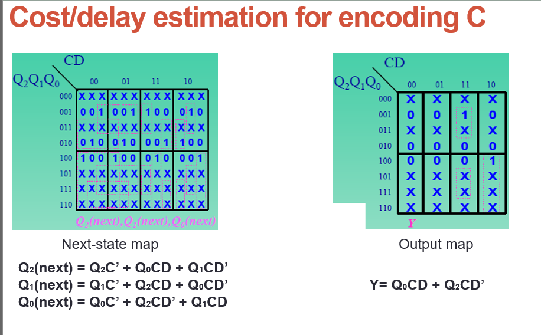

[Về trang chính](/readme.md)
## **Week 1**: Thiết kế **mạch đếm 3 (modulo-3)** sau khi **mã hoá C (encoding C)** sử dụng **Flip-Flop JK**

After Encoding C with J-K Flip Flop	

### Next-State Table			

|Present State|CD||||
|---|---|---|---|---|
|Q2Q1Q0|00|01|11|10|
|000|XXXXXX|XXXXXX|XXXXXX|XXXXXX|
|001|0X0XX0|0X0XX0|1X0XX1|0X1XX1|
|011|XXXXXX|XXXXXX|XXXXXX|XXXXXX|
|010|0XX00X|0XX00X|0XX11X|1XX10X|
|100|X00X0X|X00X0X|X11X0X|X10X1X|
|101|XXXXXX|XXXXXX|XXXXXX|XXXXXX|
|111|XXXXXX|XXXXXX|XXXXXX|XXXXXX|
|110|XXXXXX|XXXXXX|XXXXXX|XXXXXX|

### J2: Q0'CD' + Q1'CD					
| Present State |CD||||
| ------------- | --- | -- |--|--|
| Q2Q1Q0 | 00  | 01 | 11 | 10 |
| 000 | X  | X  | X  | X |
| 001    | 0   | 0  | 1  | 0  |
| 011    | X   | X  | X  | X  |
| 010    | 0   | 0  | 0  | 1  |
| 100    | X   | X  | X  | X  |
| 101    | X   | X  | X  | X  |
| 111    | X   | X  | X  | X  |
| 110    | X   | X  | X  | X  |

### J1: Q2'CD' + Q0'CD					
| Present State |CD||||
| ------------- | --- | -- |--|--|
| Q2Q1Q0 | 00  | 01 | 11 | 10 |
|    000 | X  | X  | X  | X |
| 001    | 0   | 0  | 0  | 1  |
| 011    | X   | X  | X  | X  |
| 010    | X   | X  | X  | X  |
| 100    | 0   | 0  | 1  | 0  |
| 101    | X   | X  | X  | X  |
| 111    | X   | X  | X  | X  |
| 110    | X   | X  | X  | X  |

### J0: Q2CD' + Q2'CD					

| Present State |CD||||
| ------------- | --- | -- |--|--|
| Q2Q1Q0| 00  | 01 | 11 | 10 |
| 000           | X  | X | X | X |
| 001           | X   | X  | X | X |
| 011           | X   | X  | X | X |
| 010           | 0   | 0  | 1 | 0 |
| 100           | 0   | 0  | 0 | 1 |
| 101           | X   | X  | X | X |
| 111           | X   | X  | X | X |
| 110           | X   | X  | X | X |

### K2: C 					
| Present State |     | CD |    |    |
| ------------- | --- | -- | -- | -- |
| Q2Q1Q0| 00  | 01 | 11 | 10 |
| 000 | X  | X  | X  | X |
| 001           | X   | X  | X  | X  |
| 011           | X   | X  | X  | X  |
| 010           | X   | X  | X  | X  |
| 100           | 0   | 0  | 1  | 1  |
| 101           | X   | X  | X  | X  |
| 111           | X   | X  | X  | X  |
| 110           | X   | X  | X  | X  |
### K1: C
| Present State |CD||||
| ------------- | --- | -- |--|--|
| Q2Q1Q0 | 00  | 01 | 11 | 10 |
| 000 | X  | X  | X  | X |
| 001    | X   | X  | X  | X  |
| 011    | X   | X  | X  | X  |
| 010    | 0   | 0  | 1  | 1  |
| 100    | X   | X  | X  | X  |
| 101    | X   | X  | X  | X  |
| 111    | X   | X  | X  | X  |
| 110    | X   | X  | X  | X  |

### K0: C
| Present State |CD||||
| ------------- | --- | -- |--|--|
| Q2Q1Q0 | 00  | 01 | 11 | 10 |
| 000 | X  | X  | X  | X |
| 001    | 0   | 0  | 1  | 1  |
| 011    | X   | X  | X  | X  |
| 010    | X   | X  | X  | X  |
| 100    | X   | X  | X  | X  |
| 101    | X   | X  | X  | X  |
| 111    | X   | X  | X  | X  |
| 110    | X   | X  | X  | X  |

